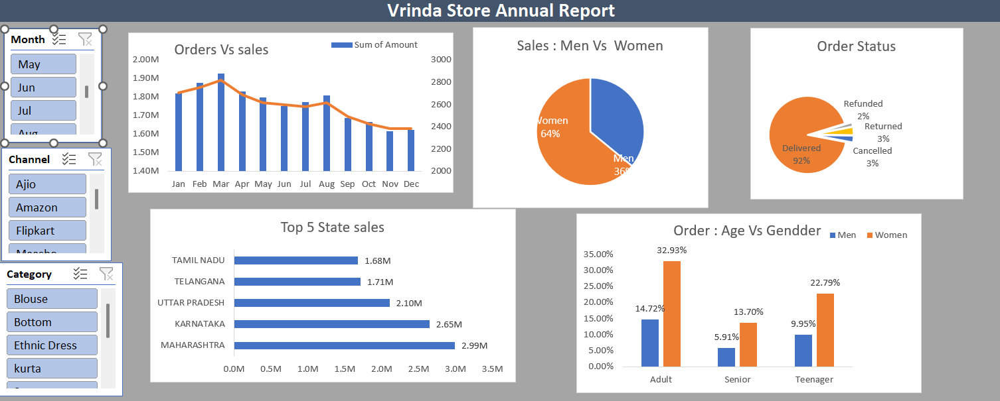

# Vrinda Store Annual Sales Data Analysis

## Project Overview
This project focuses on analyzing annual sales data of Vrinda Store to identify customer purchasing behavior, sales trends, and business insights using Microsoft Excel.

The objective was to transform raw sales data into an interactive dashboard that helps stakeholders make data-driven business decisions.

---

## Tools & Technologies
- Microsoft Excel
- Pivot Tables
- Pivot Charts
- Slicers
- Data Cleaning
- Data Visualization

---

## Key Features
- Interactive Excel Dashboard
- Monthly Sales Analysis
- Customer Demographics Analysis
- Sales Channel Performance Tracking
- Order Status Analysis
- Dynamic Filtering using Slicers

---

## Data Cleaning & Processing
- Handled missing values
- Standardized inconsistent formats
- Created calculated columns using Excel formulas
- Processed raw retail sales dataset for analysis

---

## Business Insights
- Women aged 30–49 contributed the highest sales
- Maharashtra, Karnataka, and Uttar Pradesh generated maximum revenue
- Amazon, Flipkart, and Myntra accounted for nearly 80% of total orders
- Identified top-performing sales channels and monthly sales patterns

---

## Dashboard Preview

## Project Outcome
Developed an interactive sales analytics dashboard to support business growth strategy and improve decision-making through data visualization and trend analysis.

---

## Author
Rahul Gaikwad
